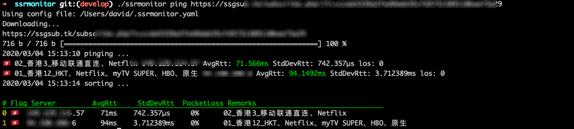
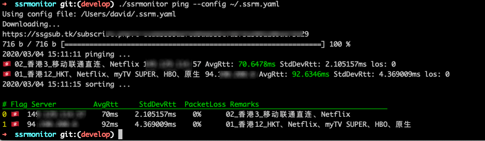
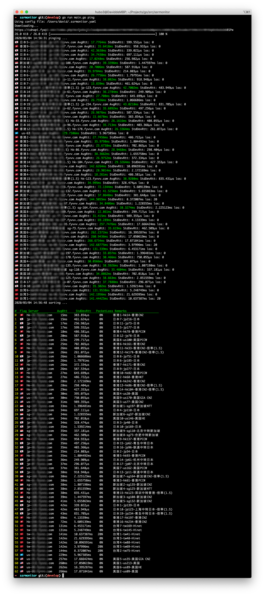

# ssrmonitor

> 因为我自己只有fenghost和ssglobal的订阅地址，对其他家的格式不了解，如果大家发现有不兼容的，可以告诉我，我来完善解析。

ssrmonitor,用来解析ssr的订阅地址，并ping获得的节点，排序结果并输出

## 用法

```bash
# 使用一个指定订阅地址
./ssrmonitor ping $url

# 指定一个配置文件
./ssrmonitor ping --config $your config file

# 使用默认配置文件（～/.ssrmonitor.yaml)
./ssrmonitor ping

# 查看当前配置文件中的订阅地址
./ssrmonitor config

# 添加一个订阅地址到配置文件
./ssrmonitor config add $url

# 删除指定索引的订阅地址
./ssrmonitor config delete $idx
```

## 示例截图






